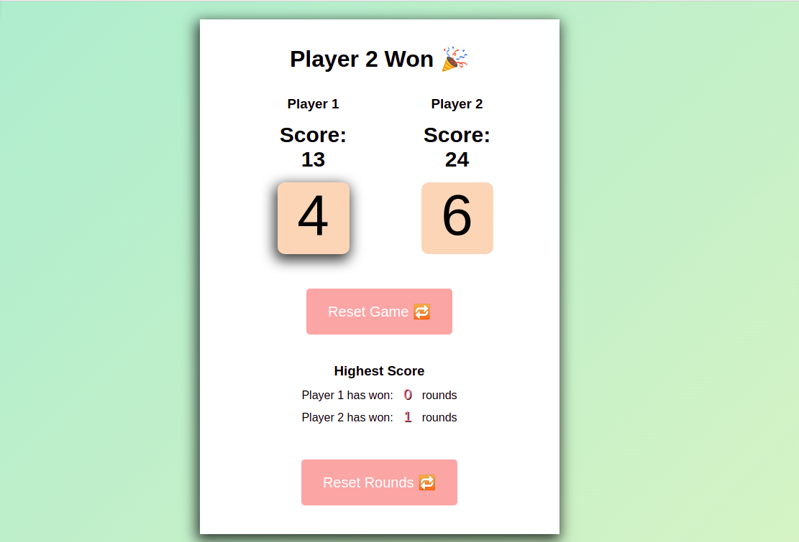

# Dice Game

Heyo, Here I created a dual player dice game using javascript. I also used the browser's built-in ```localStorage``` to persist my game's data since it's very little.

<a href="http://ijordan.tech/javascript-dice-game/">Click here to play this Dice Game</a>

### How to play 
- The game start's when a player rolls the dice for the first time, his score is recorded and counter passes to the next player.

- The first player to get a __score: 20__ or __above__ wins the round.

- The nnumber of rounds each player has won can be resetted using the __Reset Rounds__ button.
<br>
<br>


- A record of the number of rounds each player has won is shown in the __highest score__ section.

---

## Preview


---

## Resources

- I give all the credit to <a href="https://scrimba.com/playlist/pkrr5S9">Scrimba</a> for helping me through this project. They have a very interractive online learning platform with the best courses to take your web development skills to the next level.

---


## Contributors
 <a href="https://github.com/tchassijordan">
 tchassi jordan</a>

---

<h3 align="left">Languages and tools:</h3>
<p align="left"> <a href="https://www.w3schools.com/css/" target="_blank">  </a> <a href="https://www.w3.org/html/" target="_blank">  </a> <a href="https://developer.mozilla.org/en-US/docs/Web/JavaScript" target="_blank">  </a> </p>
